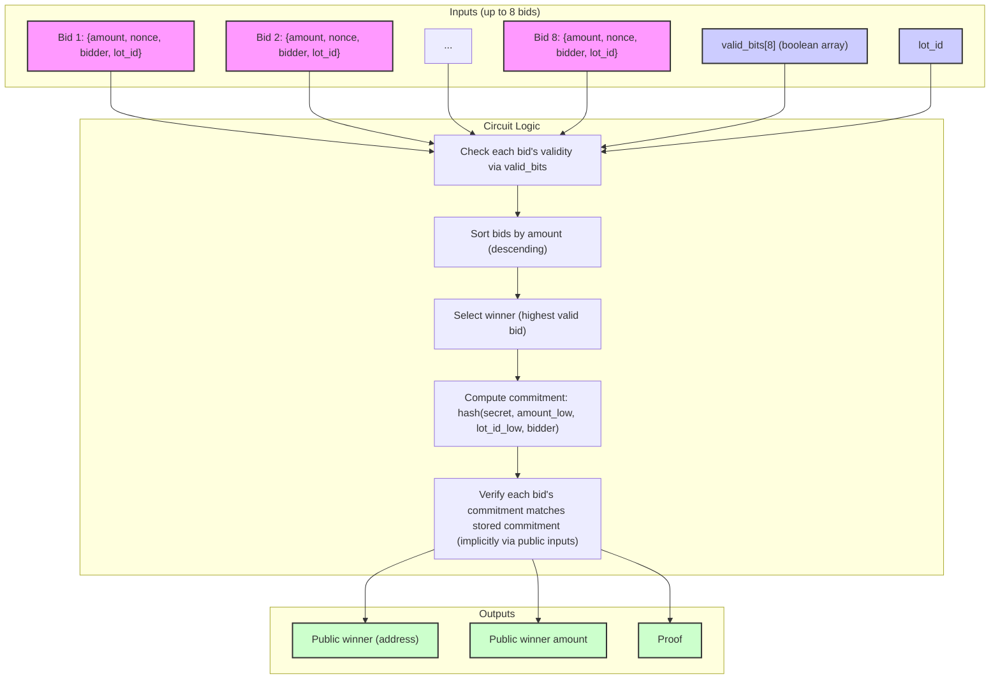
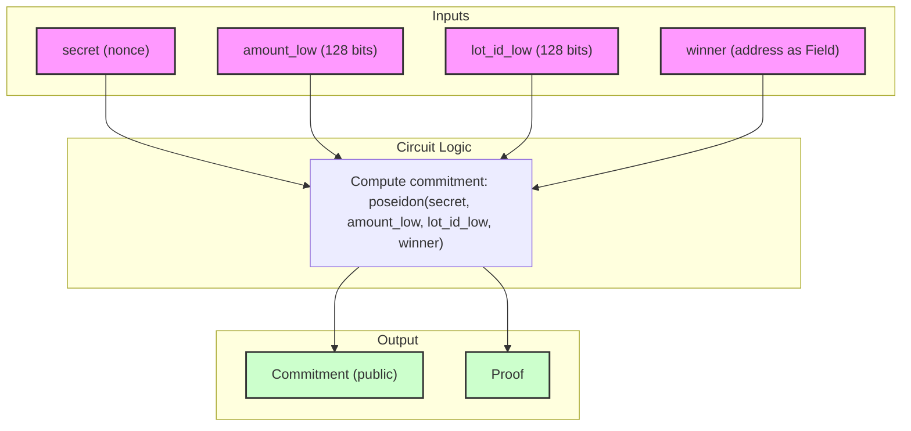
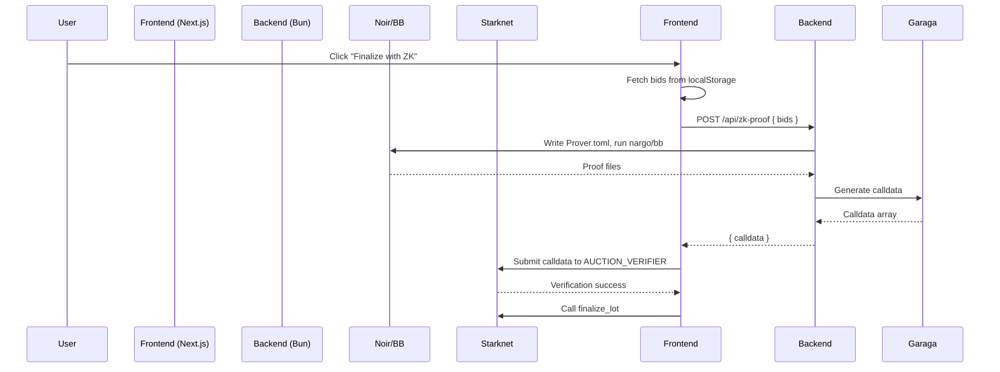

# ***🐂 zk-Sealed-Cattle: Dynamic Zero-Knowledge Sealed-Bid Auctions on Starknet***

[*https://img.shields.io/badge/License-MIT-yellow.svg*](https://img.shields.io/badge/License-MIT-yellow.svg)  
[*https://img.shields.io/badge/Starknet-Sepolia-blue*](https://img.shields.io/badge/Starknet-Sepolia-blue)  
[*https://img.shields.io/badge/Built%2520with-Scaffold--Stark%25202-purple*](https://img.shields.io/badge/Built%2520with-Scaffold--Stark%25202-purple)  
[*https://img.shields.io/badge/CAVOS-Social%2520Login-green*](https://img.shields.io/badge/CAVOS-Social%2520Login-green)  
[*https://img.shields.io/badge/ZK-Dynamic-orange*](https://img.shields.io/badge/ZK-Dynamic-orange)

---

## ***📚 Table of Contents***

1. *Overview*  
2. *Key Features – What Makes This App Stand Out*  
3. *Technology Stack*  
4. *How It Works (Auction Flow)*  
5. *Project Architecture: Frontend \+ Backend ZK Service*  
   * *5.1 Frontend: Next.js (Scaffold-Stark 2\)*  
   * *5.2 Backend: Dynamic ZK Proof Service (Scaffold-Garaga)*  
6. *ZK Circuits: The Core of Privacy*  
   * *6.1 `selection` Circuit – Auction Finalization*  
   * *6.2 `payment` Circuit – Winner Payment*  
   * *6.3 Circuit Diagrams*  
7. *Dynamic Proof Generation: How It Really Works*  
   * *7.1 Flow Diagram*  
   * *7.2 Backend API Endpoints*  
   * *7.3 Frontend Integration & Proxy*  
   * *7.4 Testing with `curl`*  
8. *CAVOS Social Login Integration*  
9. *Smart Contract Architecture*  
   * *9.1 Key Functions*  
   * *9.2 Storage*  
10. *Frontend Architecture (Deep Dive)*  
    * *10.1 State Management*  
    * *10.2 Key Hooks and Effects*  
11. *Backend Proof Service (Deep Dive)*  
    * *11.1 Process for Each Endpoint*  
    * *11.2 Version Pinning*  
12. *Key Challenges & Solutions*  
13. *Lessons Learned*  
14. *Deployed Contracts (Sepolia Testnet)*  
15. *Quick Start Guide*  
    * *15.1 Prerequisites*  
    * *15.2 Native Installation (Linux/macOS/WSL)*  
    * *15.3 Docker \+ Dev Containers (Recommended for Windows)*  
    * *15.4 Setting Up the Backend Proof Service*  
16. *Running the Project (Four-Terminal Setup)*  
17. *Testing*  
    * *17.1 Smart Contract Tests (Starknet Foundry)*  
    * *17.2 Frontend Tests (Next.js)*  
18. *Deployment to Sepolia Testnet*  
19. *Useful Links & References*  
20. *Contributing & License*

---

## ***🚀 1\. Overview***

*zk-Sealed-Cattle is a cutting-edge decentralized application (dApp) on Starknet that implements sealed-bid auctions for cattle feedlots, enhanced with dynamic zero-knowledge proofs (ZKPs) for privacy and trust. Unlike static proof systems, this project features a dedicated backend service that generates proofs on-demand, allowing for a seamless and scalable user experience. Bidders can participate privately, and the auction owner can finalize lots with a single click – all powered by Noir, Barretenberg, and Garaga verifiers.*

*The project is a fork of the popular [Scaffold-Stark 2](https://github.com/scaffold-stark/scaffold-stark-2) template and integrates a custom backend based on [Scaffold-Garaga](https://github.com/vices1967-beep/scaffold-garaga). It also features CAVOS social login for frictionless onboarding.*

---

## ***✨ 2\. Key Features – What Makes This App Stand Out***

| *Feature* | *Description* |
| :---- | :---- |
| *🔐 True Sealed-Bid Auctions* | *Bidders commit to a bid via a Poseidon hash; bids are only revealed after the auction ends.* |
| *⚡ Dynamic ZK Proofs* | *Proofs are generated on-the-fly by a backend service, not pre-computed. The frontend requests calldata and submits it to the verifier – fully automated.* |
| *🧩 Two Independent ZK Circuits* | *`selection` for auction finalization and `payment` for winner payment – both integrated dynamically.* |
| *🌉 Backend \+ Frontend Separation* | *Clean architecture: Next.js frontend, Bun/Express backend with Noir/BB/Garaga toolchain.* |
| *🔑 CAVOS Social Login* | *Users can log in with Google, and Cavos paymaster sponsors gas fees – no wallet required for newcomers.* |
| *📦 Multi-Lot Support* | *Create multiple lots with custom metadata (breed, weight, IPFS).* |
| *💾 Persistent Bid Storage* | *Bids stored in `localStorage` for easy recovery and replay.* |
| *✅ Fully On-Chain Verifiers* | *Garaga-generated verifier contracts deployed on Sepolia testnet.* |
| *🧪 Testable via `curl`* | *Backend endpoints can be tested independently, ensuring reliability.* |

---

## ***🛠️ 3\. Technology Stack***

| *Category* | *Technologies* |
| :---- | :---- |
| *Frontend* | *Next.js (App Router), TypeScript, Tailwind CSS, Starknet.js, Starknet‑React, [Scaffold-Stark 2](https://github.com/scaffold-stark/scaffold-stark-2)* |
| *Backend* | *Bun, Express, child\_process (for Noir/BB commands)* |
| *Smart Contracts* | *Cairo (Scarb), [Starknet Foundry](https://foundry-rs.github.io/starknet-foundry/) (snforge, sncast)* |
| *ZK Circuits* | *[Noir](https://noir-lang.org/) (v1.0.0-beta.1), [Barretenberg](https://github.com/AztecProtocol/aztec-packages) (bb v0.67.0), [Garaga](https://garaga.gitbook.io/) (v0.15.5)* |
| *Authentication* | *[CAVOS](https://cavos.xyz/) – social login with passkeys and paymaster* |
| *Infrastructure* | *GitHub Codespaces, Docker, Starknet Devnet, Sepolia Testnet* |

---

## ***🔄 4\. How It Works (Auction Flow)***

1. *Lot Creation (Owner only):*  
   *Owner fills in lot details (breed, weight, animal count, IPFS metadata hash, duration) and creates the lot on-chain.*  
2. *Bidding Phase:*  
   * *Bidder chooses a secret nonce and bid amount.*  
   * *Frontend computes the Poseidon hash: `hash(secret, amount_low, lot_id_low, bidder)`.*  
   * *Bidder sends `commit_bid` transaction with the hash.*  
   * *The bid data is also saved in `localStorage` for later revelation.*  
3. *Reveal Phase:*  
   * *Before the auction ends, bidders reveal their plaintext `amount` and `nonce`.*  
   * *Contract verifies that the hash matches the previously stored commitment.*  
   * *The highest bid is tracked on-chain.*  
4. *Auction Finalization (Owner only):*  
   * *After the auction ends, the owner calls `handleFinalizeWithZK`.*  
   * *Frontend fetches all bids from `localStorage` and sends them to the backend (`/api/zk-proof`).*  
   * *Backend generates a proof using the `selection` circuit and returns calldata.*  
   * *Frontend submits the calldata to the `AUCTION_VERIFIER_ADDRESS`; if valid, then calls `finalize_lot`.*  
   * *The lot is marked as finalized, and the winner is recorded.*  
5. *Winner Payment:*  
   * *The winner (highest bidder) can generate a ZK payment proof.*  
   * *Frontend retrieves the winning bid from `localStorage` and sends it to `/api/zk-payment`.*  
   * *Backend generates a proof using the `payment` circuit and returns calldata.*  
   * *Frontend submits the calldata to `VERIFIER_ADDRESS`; on success, the winner is marked as paid.*

---

## ***🏗️ 5\. Project Architecture: Frontend \+ Backend ZK Service***

*The project is split into two main components, each with its own repository focus but combined here for a full-stack solution.*

### ***5.1 Frontend: Next.js (Scaffold-Stark 2\)***

*Located in `/packages/nextjs`, this is a standard Scaffold-Stark 2 application. It provides the user interface for creating lots, placing bids, and interacting with the auction contracts. It communicates with the backend via a Next.js rewrite proxy to avoid CORS issues.*

*Key files:*

* *`app/page.tsx` – Main auction interface with dynamic ZK finalize and payment functions.*  
* *`hooks/useScaffoldContract.ts` – Custom hooks for contract interactions.*  
* *`next.config.js` – Rewrites to forward `/api/zk-proof` and `/api/zk-payment` to the backend.*  
* *`.env` – Environment variables (contract addresses, CAVOS keys, backend URL).*

*Project Structure:*

```
packages/
├── nextjs/                 # Next.js frontend
│   ├── app/                # App router pages
│   ├── components/         # React components
│   ├── hooks/              # Custom Starknet hooks
│   ├── public/             # Static assets (calldata_*.txt, images)
│   └── services/           # Garaga service (optional)
│
├── snfoundry/              # Smart contract development
    ├── contracts/          # Cairo contracts (src/)
    ├── scripts-ts/         # Deployment scripts
    └── tests/              # Starknet Foundry tests
```

### ***5.2 Backend: Dynamic ZK Proof Service (Scaffold-Garaga)***

*Located in `/packages/backend`, this service is a fork of the [Scaffold-Garaga](https://github.com/vices1967-beep/scaffold-garaga) repository. It exposes two REST endpoints that accept bid data, run the Noir circuits, and return the calldata needed for Starknet verification.*

*Backend structure:*

```
packages/backend/
├── circuits/
│   ├── selection/selection/        # selection circuit (Noir)
│   └── payment/                    # payment circuit (Noir)
├── garaga-venv/                     # Python virtual env for Garaga
├── index.ts                         # Main Bun/Express server
├── package.json
└── tsconfig.json
```

*The backend is designed to run in GitHub Codespaces or any Linux environment. The live instance is available at:*  
*🔗 [https://miniature-palm-tree-pjqg75xvjjrjfggr-3001.app.github.dev](https://miniature-palm-tree-pjqg75xvjjrjfggr-3001.app.github.dev/)*

---

## ***🔐 6\. ZK Circuits: The Core of Privacy***

| *Circuit* | *Purpose* | *Noir Version* | *BB Version* | *Garaga System* |
| :---- | :---- | :---- | :---- | :---- |
| *`payment`* | *Prove payment and commitment correctness* | *1.0.0‑beta.1* | *0.67.0* | *ultra\_keccak\_honk* |
| *`selection`* | *Prove winner is the highest bid and meets price* | *1.0.0‑beta.1* | *0.67.0* | *ultra\_keccak\_honk* |

*Both circuits compile with Noir 1.0.0‑beta.1 and proofs are generated using bb 0.67.0 (UltraHonk \+ Keccak for Starknet). The calldata for the Starknet verifiers is produced by Garaga 0.15.5.*

### ***6.1 `selection` Circuit – Auction Finalization***

* *Purpose: Prove that the declared winner is indeed the highest bidder and that the bid meets the required price, without revealing all bids.*  
* *Inputs: Up to 8 bids (each with `amount`, `nonce`, `bidder`, `lot_id`) and a `valid_bits` array.*  
* *Output: Public commitment (the winner's bid) and a proof of correct ordering.*  
* *Location: `packages/backend/circuits/selection/selection/`*  
* *Verifier Contract: `0x05c76e04b1384953264c98d5dc1f5b69d44e2cb6086567fe7944c62b08b58080`*

*The circuit expects exactly 8 bids. Fill unused slots with zeros and set `valid_bids` accordingly.*

*Example `Prover.toml` for a single bid:*

```
bids = [
  { amount = 500, nonce = 12345, bidder = "0x...", lot_id = 18 },
  { amount = 0, nonce = 0, bidder = "0x0", lot_id = 0 },
  { amount = 0, nonce = 0, bidder = "0x0", lot_id = 0 },
  { amount = 0, nonce = 0, bidder = "0x0", lot_id = 0 },
  { amount = 0, nonce = 0, bidder = "0x0", lot_id = 0 },
  { amount = 0, nonce = 0, bidder = "0x0", lot_id = 0 },
  { amount = 0, nonce = 0, bidder = "0x0", lot_id = 0 },
  { amount = 0, nonce = 0, bidder = "0x0", lot_id = 0 }
]
valid_bids = [true, false, false, false, false, false, false, false]
lot_id = 18
```

### ***6.2 `payment` Circuit – Winner Payment***

* *Purpose: Prove that the winner knows the secret nonce that, together with the bid amount, lot ID, and winner address, produces the previously committed hash.*  
* *Inputs: `secret`, `amount_low`, `lot_id_low`, `winner` (address as field).*  
* *Output: The hash (commitment) as a public input.*  
* *Location: `packages/backend/circuits/payment/`*  
* *Verifier Contract: `0x07b31788d2d06f1b80696f38ba7224f3595cc482dbd2f816165dbc7cdf476c14`*

*Both circuits follow patterns from the [Starknet Privacy Toolkit](https://github.com/od-hunter/starknet-privacy-toolkit) by Omar Espejel.*

### ***6.3 Circuit Diagrams***

#### ***Selection Circuit Flow***



#### ***Payment Circuit Flow***



---

## ***⚡ 7\. Dynamic Proof Generation: How It Really Works***

*The key innovation of this project is that proofs are generated dynamically at runtime, not pre-computed. This is achieved by a backend service that wraps the Noir/BB/Garaga toolchain.*

### ***7.1 Flow Diagram***



### ***7.2 Backend API Endpoints***

| *Endpoint* | *Method* | *Request Body* | *Response* | *Description* |
| :---- | :---- | :---- | :---- | :---- |
| *`/api/zk-proof`* | *POST* | *`{ "bids": [...] }`* | *`{ "calldata": string[] }`* | *Generates calldata for the `selection` circuit.* |
| *`/api/zk-payment`* | *POST* | *`{ "bid": { ... } }`* | *`{ "calldata": string[] }`* | *Generates calldata for the `payment` circuit.* |

### ***7.3 Frontend Integration & Proxy***

*The frontend calls these endpoints via relative URLs (e.g., `/api/zk-proof`). In development, Next.js rewrites these to the backend URL specified in `NEXT_PUBLIC_BACKEND_URL`. This avoids CORS and keeps the frontend code clean.*

*Example from `next.config.js`:*

```javascript
async rewrites() {
  const backendUrl = process.env.NEXT_PUBLIC_BACKEND_URL || 'https://...';
  return [
    { source: '/api/zk-proof', destination: `${backendUrl}/api/zk-proof` },
    { source: '/api/zk-proof/:path*', destination: `${backendUrl}/api/zk-proof/:path*` },
    { source: '/api/zk-payment', destination: `${backendUrl}/api/zk-payment` },
    { source: '/api/zk-payment/:path*', destination: `${backendUrl}/api/zk-payment/:path*` },
  ];
}
```

### ***7.4 Testing with `curl`***

*You can test the backend independently:*

*For `selection` circuit:*

```shell
curl -X POST https://miniature-palm-tree-pjqg75xvjjrjfggr-3001.app.github.dev/api/zk-proof \
  -H "Content-Type: application/json" \
  -d '{
    "bids": [
      {"amount":"1000","secret":"123456","winner":"0x4f34...","lot_id":"2","commitment":"0x0"},
      {"amount":"1500","secret":"654321","winner":"0x0626...","lot_id":"2","commitment":"0x0"}
    ]
  }'
```

*For `payment` circuit:*

```shell
curl -X POST https://miniature-palm-tree-pjqg75xvjjrjfggr-3001.app.github.dev/api/zk-payment \
  -H "Content-Type: application/json" \
  -d '{
    "bid": {
      "secret": "614053",
      "amount": "15000",
      "lot_id": "4",
      "winner": "0x4f348398f859a55a0c80b1446c5fdc37edb3a8478a32f10764659fc241027d3"
    }
  }'
```

*Expected response:*

```json
{
  "calldata": ["0x1234", "0x5678", ...]
}
```

---

## ***🔑 8\. CAVOS Social Login Integration***

[*CAVOS*](https://cavos.xyz/) *provides a seamless way for users to authenticate with their Google account and interact with Starknet without managing private keys. It uses passkeys and a paymaster to sponsor transaction fees.*

*Integration points:*

* *`useCavos` hook – imported from `@cavos/react` to access authentication state and execute transactions.*  
* *Conditional execution – The app supports both Cavos and traditional wallets (Argent X, Braavos). The `executeTransaction` utility chooses the appropriate method.*  
* *Paymaster – Cavos covers gas costs for social login users, making onboarding frictionless.*

*Environment variables required (in `packages/nextjs/.env`):*

```
NEXT_PUBLIC_CAVOS_APP_ID=d3a4a051-795d-47ea-994e-8aaf9626e335
NEXT_PUBLIC_CAVOS_PAYMASTER_TOKEN=cav_kN_KHr4vWCTL2k5MD8Ow_kcQqslKPDlMcP1lE8EOQ1d4D_xx (Example.)
```

*When a user logs in with Google, `activeAccountAddress` is set to the Cavos address, and all transactions are routed through Cavos.*

---

## ***📜 9\. Smart Contract Architecture***

*The main contract `SealedBidFeedlot` (Cairo) handles the auction logic.*

### ***9.1 Key Functions***

| *Function* | *Description* |
| :---- | :---- |
| *`create_lot`* | *Owner only, sets up a new lot with metadata and duration.* |
| *`commit_bid`* | *Stores a Poseidon commitment for a bidder.* |
| *`reveal_bid`* | *Verifies the commitment and updates the highest bid if needed.* |
| *`finalize_lot`* | *Simple finalization (owner only).* |
| *`finalize_with_zk`* | *Calls the auction verifier contract; if proof is valid, finalizes and records the winner.* |
| *`verify_payment`* | *Winner calls this with a proof from the payment circuit; marks the lot as paid.* |
| *`get_bidders_count` / `get_bidder_at`* | *For enumerating bidders (used to check participation).* |
| *`is_payment_done`* | *Checks if payment has been verified.* |
| *`get_winner`* | *Returns the stored winner record (address and amount).* |
| *`debug_reveal`* | *Helper to diagnose commitment mismatches.* |

### ***9.2 Storage***

```rust
commitments: Map<(ContractAddress, u256), felt252>,
lots: Map<u256, LotInfo>,
owner: Map<(), ContractAddress>,
bidders_count: Map<u256, u32>,
bidder_at: Map<(u256, u32), ContractAddress>,
auction_verifier: ContractAddress,
payment_verifier: ContractAddress,
payment_done: Map<u256, bool>,
winner_record: Map<u256, (ContractAddress, u256)>,
```

---

## ***🖥️ 10\. Frontend Architecture (Deep Dive)***

*The frontend (`packages/nextjs/app/page.tsx`) is a single‑page application with:*

### ***10.1 State Management***

* *React hooks (`useState`, `useEffect`, `useCallback`, `useRef`).*  
* *Contract interaction via `useContract` from `@starknet-react/core`.*  
* *Cavos integration via `useCavos` hook.*

### ***10.2 Key Hooks and Effects***

* *`checkIfUserParticipated` – Queries the contract to see if the current account has bid in a lot.*  
* *`verifyAndRestore` (useEffect) – On account or lot change, checks on‑chain participation and restores commit data from `localStorage` only if the account actually participated.*  
* *Account change cleanup (useEffect) – Resets all account‑specific states when switching accounts.*  
* *Clock (useEffect) – Updates `currentTime` every second for auction countdown.*  
* *`fetchAllLots` (useCallback) – Retrieves lot info, payment status, and winner records in one go.*

*Unified transaction execution:*

```ts
const executeTransaction = async (call: any) => {
  if (isCavosAuth) {
    // Cavos: auto‑register session if needed
  } else if (walletAccount) {
    const tx = await walletAccount.execute([call]);
    return tx;
  }
};
```

---

## ***⚙️ 11\. Backend Proof Service (Deep Dive)***

*Located in `packages/backend`, this Bun/Express service dynamically generates ZK proofs.*

### ***11.1 Process for Each Endpoint***

1. *Write a `Prover.toml` file in the corresponding circuit directory.*  
2. *Run `nargo compile` and `nargo execute witness` (with retry).*  
3. *Run `bb prove_ultra_keccak_honk`, `bb write_vk_ultra_keccak_honk`, and `bb proof_as_fields_honk`.*  
4. *Use `garaga` to convert the proof to Starknet calldata.*  
5. *Return `{ calldata: string[] }`.*

### ***11.2 Version Pinning***

*The backend uses exact versions to ensure compatibility:*

* *Noir: 1.0.0-beta.1*  
* *Barretenberg (bb): 0.67.0*  
* *Garaga: 0.15.5*  
* *Python: 3.10*  
* *Bun: 1.0.2*

*It runs in GitHub Codespaces to avoid OS‑specific issues.*

---

## ***🧩 12\. Key Challenges & Solutions***

*Throughout development, we encountered several critical issues. Here’s how we solved them:*

| *Challenge* | *Solution* |
| :---- | :---- |
| *ESLint errors blocking Vercel deployment* | *Configured `eslint.ignoreDuringBuilds: true` in `next.config.js` and set up proper TypeScript ESLint rules.* |
| *Cavos API key exposed in frontend* | *Renamed variable to `NEXT_PUBLIC_CAVOS_PAYMASTER_TOKEN` (removed "KEY") to silence Vercel warning; key is safe because it’s a public token.* |
| *Session not registered on‑chain with Cavos* | *Added `walletStatus` check and `registerCurrentSession()` before transactions; always call `updateSessionPolicy()` before registration.* |
| *"Commitment mismatch" errors on reveal* | *Added `debug_reveal` function to contract; used it to compare computed vs stored commitments and identify address mismatches (Cavos paymaster vs caller).* |
| *UI showing "Reveal" for accounts without a commit* | *Modified restoration effect to only set `committed = true` if the account has actually participated on‑chain (`checkIfUserParticipated`).* |
| *Infinite re‑renders of `WinnerDisplay`* | *Fetched winner data once during `fetchAllLots` and stored it in the lot object; removed the separate component.* |
| *LocalStorage contamination across accounts* | *Always verify on‑chain participation before restoring any local state; clear account‑specific states on account change.* |
| *Backend proof generation failing for multiple bids* | *Ensured `Prover.toml` includes exactly 8 bids with `valid_bits`; added retry logic for witness generation.* |

---

## ***🎓 13\. Lessons Learned***

1. *Always verify on‑chain before trusting local state – `localStorage` is convenient but can become stale or mixed between accounts. Use contract queries to confirm participation, winner records, etc., before updating UI.*  
2. *Handle Cavos sessions explicitly – After login, wait for `walletStatus.isReady`; if not ready, call `registerCurrentSession()`. Always update the session policy (`updateSessionPolicy`) before registering to ensure spending limits are correct.*  
3. *Separate UI logic from participation state – Use `committed` and `revealed` flags that are restored from `localStorage` only after on‑chain verification, rather than relying solely on `participatedLotes`.*  
4. *Fetch data once, store it – Avoid components with their own data‑fetching effects that run on every render. Instead, fetch all necessary data (like winner records) in a parent component and pass it down or store it in a global state.*  
5. *Debugging tools are essential – The `debug_reveal` function was invaluable for diagnosing commitment mismatches. Always include such helpers in contracts.*  
6. *Version pinning is critical – The Noir/BB/Garaga toolchain is sensitive to versions. Use exact versions and document them clearly.*  
7. *Cavos paymaster addresses – When using Cavos, the `account_contract_address` (from `get_tx_info()`) may differ from the caller address. Always use `account_contract_address` for commitment calculations to match the commit transaction.*

---

## ***📜 14\. Deployed Contracts (Sepolia Testnet)***

| *Contract* | *Address* | *Description* |
| :---- | :---- | :---- |
| *Auction (Main)* | *`0x3d64343fe5fd52d4e760067a4c919cadc10f464dbef01911f6cb8f549058867`* | *Main `SealedBidFeedlot` contract* |
| *Payment Verifier* | *`0x07b31788d2d06f1b80696f38ba7224f3595cc482dbd2f816165dbc7cdf476c14`* | *Verifies proofs from the `payment` circuit* |
| *Selection Verifier* | *`0x05c76e04b1384953264c98d5dc1f5b69d44e2cb6086567fe7944c62b08b58080`* | *Verifies proofs from the `selection` circuit* |
| *STRK Token* | *`0x049d36570d4e46f48e99674bd3fcc84644ddd6b96f7c741b1562b82f9e004dc7`* | *Standard ERC-20 token (used for bids)* |
| *(Reference) Tongo* | *`0x00b4cca30f0f641e01140c1c388f55641f1c3fe5515484e622b6cb91d8cee585`* | *Tongo contract (from privacy toolkit, for demo)* |

*Note: The owner address (who can create lots) is set to your address ex: `0x0626bb9241ba6334ae978cfce1280d725e727a6acb5e61392ab4cee031a4b7ca` (the deployer).*

---

## ***🚀 15\. Quick Start Guide***

### ***15.1 Prerequisites***

* *Node.js (≥ v22)*  
* *Yarn (v1 or v2+)*  
* *Git*  
* *Docker (optional, for Dev Containers)*

### ***15.2 Native Installation (Linux/macOS/WSL)***

#### ***1\. Install Starkup (Recommended)***

```shell
curl --proto '=https' --tlsv1.2 -sSf https://sh.starkup.sh | sh
```

*Verify:*

```shell
scarb --version
snforge --version
starknet-devnet --version
```

*Important: Ensure versions match those in Compatible Versions. Use `asdf` to set correct versions if needed (see [Scaffold-Stark 2 Troubleshooting](https://github.com/scaffold-stark/scaffold-stark-2#13-troubleshooting)).*

#### ***2\. Clone the Repository***

```shell
git clone https://github.com/vices1967-beep/zk-sealed-cattle.git
cd zk-sealed-cattle
```

#### ***3\. Install JavaScript Dependencies***

```shell
yarn install
```

#### ***4\. Set Up Environment Variables***

```shell
cp packages/nextjs/.env.example packages/nextjs/.env
cp packages/snfoundry/.env.example packages/snfoundry/.env
```

*Edit these files with your own values (CAVOS keys, contract addresses, etc.).*

### ***15.3 Docker \+ Dev Containers (Recommended for Windows)***

1. *Install Docker Desktop.*  
2. *Install the Dev Containers extension for VS Code.*  
3. *Open the project folder in VS Code and select "Reopen in Container".*  
4. *The container includes all tools pre‑configured.*

### ***15.4 Setting Up the Backend Proof Service***

1. *Navigate to the backend:*

```shell
cd packages/backend
```

2. *Install Bun dependencies:*

```shell
bun install
```

3. *Install Noir and Barretenberg:*

```shell
make install-noir
make install-barretenberg
```

4. *Set up Garaga:*

```shell
python3.10 -m venv garaga-venv
source garaga-venv/bin/activate
pip install garaga==0.15.5
```

5. *Ensure the circuits are present (they should be). If not, copy them from the [scaffold-garaga](https://github.com/vices1967-beep/scaffold-garaga) repository.*

---

## ***🏃 16\. Running the Project (Four-Terminal Setup)***

*You'll need four terminal windows.*

| *Terminal* | *Command* | *Description* |
| :---- | :---- | :---- |
| *1* | *`yarn chain`* | *Starts Starknet Devnet at `http://127.0.0.1:5050`* |
| *2* | *`yarn deploy`* | *Deploys the auction contract to Devnet* |
| *3* | *`cd packages/backend && bun run index.ts`* | *Starts the backend proof service on port 3001* |
| *4* | *`yarn start`* | *Starts the Next.js frontend at `http://localhost:3000`* |

*Now open `http://localhost:3000` and start using the app\!*

---

## ***🧪 17\. Testing***

### ***17.1 Smart Contract Tests (Starknet Foundry)***

```shell
yarn test
```

### ***17.2 Frontend Tests (Next.js)***

```shell
yarn test:nextjs
```

*For coverage:*

```shell
yarn test:nextjs run --coverage
```

---

## ***🌐 18\. Deployment to Sepolia Testnet***

1. *Fund your deployer account with Sepolia STRK (use [Starknet Faucet](https://faucet.starknet.io/) or [Blastapi](https://blastapi.io/)).*  
2. *Fill environment variables in `packages/snfoundry/.env`:*

```
DEPLOYER_ADDRESS=0xYourAccountAddress
DEPLOYER_PRIVATE_KEY=0xYourPrivateKey
```

3. *Configure target network in `packages/nextjs/scaffold.config.ts`:*

```ts
import { chains } from "@starknet-react/chains";
export const targetNetworks = [chains.sepolia];
```

4. *Deploy the contract:*

```shell
yarn deploy --network sepolia
```

5. *Update frontend `.env` with the new contract address and start the frontend.*

---

## ***🔗 19\. Useful Links & References***

* *Project Repository: [github.com/vices1967-beep/zk-sealed-cattle](https://github.com/vices1967-beep/zk-sealed-cattle)*  
* *Live Frontend: [zk-sealed-cattle-nextjs.vercel.app](https://zk-sealed-cattle-nextjs.vercel.app/)*  
* *Backend Proof Service: [miniature-palm-tree-pjqg75xvjjrjfggr-3001.app.github.dev](https://miniature-palm-tree-pjqg75xvjjrjfggr-3001.app.github.dev/)*  
* *Scaffold-Stark 2: [github.com/scaffold-stark/scaffold-stark-2](https://github.com/scaffold-stark/scaffold-stark-2)*  
* *Scaffold-Garaga (Fork): [github.com/vices1967-beep/scaffold-garaga](https://github.com/vices1967-beep/scaffold-garaga) (original: [KevinSheeranxyj/scaffold-garaga](https://github.com/KevinSheeranxyj/scaffold-garaga))*  
* *CAVOS Social Login: [cavos.xyz](https://cavos.xyz/)*  
* *Starknet Privacy Toolkit: [github.com/od-hunter/starknet-privacy-toolkit](https://github.com/od-hunter/starknet-privacy-toolkit)*  
* *Noir Language: [noir-lang.org](https://noir-lang.org/)*  
* *Garaga Docs: [garaga.gitbook.io](https://garaga.gitbook.io/)*  
* *Starknet.js: [starknetjs.com](https://starknetjs.com/)*

---

## ***🤝 20\. Contributing & License***

*Contributions are welcome\! Please open an issue or pull request on [GitHub](https://github.com/vices1967-beep/zk-sealed-cattle). For major changes, please open an issue first to discuss what you would like to change.*

*License: This project is licensed under the MIT License – see the [LICENSE](https://license/) file for details.*

---

*Made with ❤️ by the Tokenized Cattle Team*

