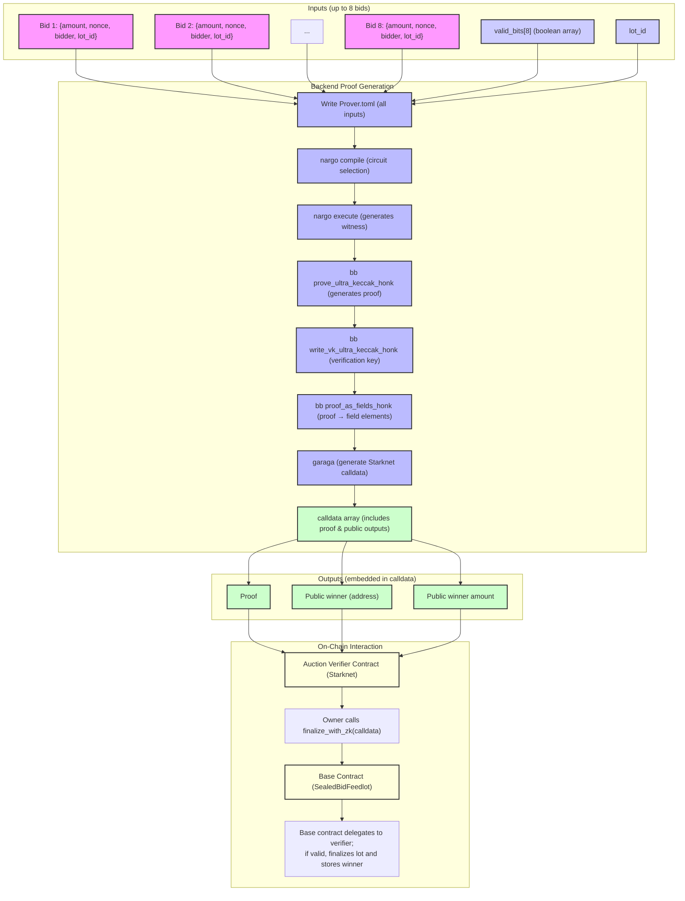
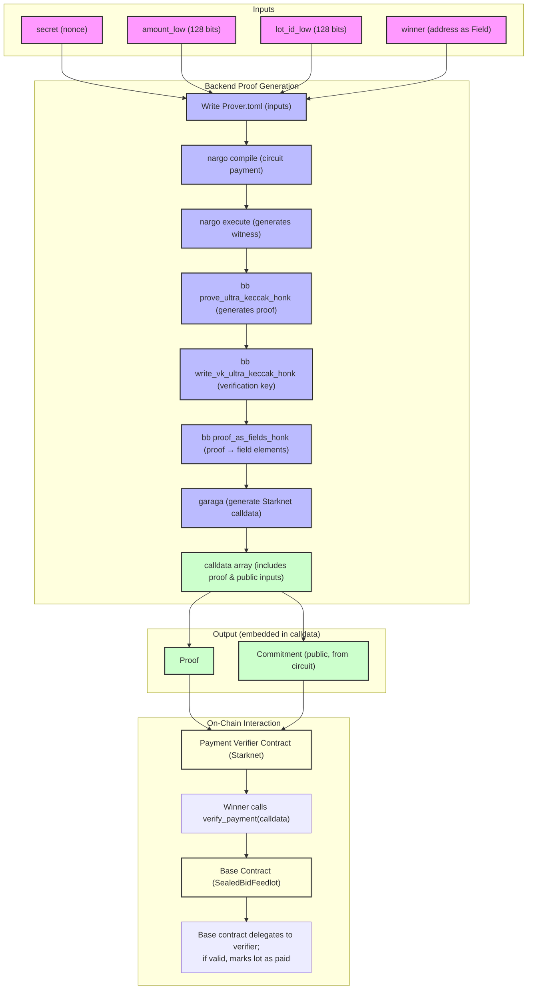
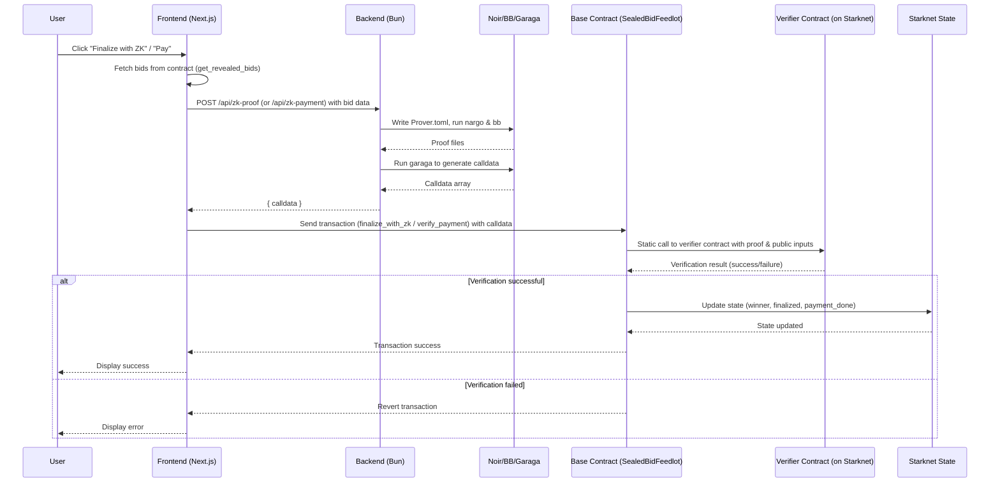

<table>
  <tr>
    <td width="50%" valign="top">
      <h1><strong>zk-Sealed-Cattle: Dynamic Zero-Knowledge Sealed-Bid Auctions on Starknet</strong></h1>
      <p>
        <br>
        <br>
        <br>
        <br>
        <br>
        
      </p>
    </td>
    <td width="50%" align="center">
      
    </td>
  </tr>
</table>

## **📚 Table of Contents**

1. Overview  
2. Key Features  
3. Technology Stack  
4. How It Works (Auction Flow)  
5. Project Architecture: Frontend \+ Backend ZK Service  
   * 5.1 Frontend: Next.js (Scaffold-Stark 2\)  
   * 5.2 Backend: Dynamic ZK Proof Service (Scaffold-Garaga)  
6. ZK Circuits: The Core of Privacy  
   * 6.1 `selection` Circuit – Auction Finalization  
   * 6.2 `payment` Circuit – Winner Payment  
   * 6.3 Circuit Diagrams  
   * 6.4 Acknowledgements  
7. Dynamic Proof Generation: How It Really Works  
   * 7.1 Flow Diagram  
   * 7.2 Backend API Endpoints  
   * 7.3 Frontend Integration & Proxy  
   * 7.4 Testing with curl  
8. Wallet Integration: Braavos, Argent X, and CAVOS Social Login  
9. Smart Contract Architecture  
   * 9.1 Key Functions  
   * 9.2 Storage  
10. Frontend Architecture (Deep Dive)  
    * 10.1 State Management  
    * 10.2 Key Hooks and Effects  
11. Backend Proof Service (Deep Dive)  
    * 11.1 Process for Each Endpoint  
    * 11.2 Version Pinning  
12. Key Challenges & Solutions  
13. Lessons Learned  
14. Future Vision: The Complete Agricultural Finance Ecosystem  
15. Deployed Contracts (Sepolia Testnet)  
16. Quick Start Guide  
    * 16.1 Prerequisites  
    * 16.2 Native Installation (Linux/macOS/WSL)  
    * 16.3 Setting Up the Backend Proof Service in GitHub Codespaces  
    * 16.4 Running the Project  
17. Deployment to Sepolia Testnet  
    * 17.1 Prepare a Sepolia Deployer Account  
    * 17.2 Update Environment Variables for Sepolia  
    * 17.3 Deploy the Contract to Sepolia  
    * 17.4 Register Verifiers with the Main Contract Using `sncast`  
18. Useful Links & References  
19. Contributing & License

---

## **🚀 1\. Overview**

zk-Sealed-Cattle is a cutting-edge decentralized application (dApp) on Starknet that implements sealed-bid auctions for cattle feedlots, enhanced with dynamic zero-knowledge proofs (ZKPs) for privacy and trust. Unlike static proof systems, this project features a dedicated backend service that generates proofs on-demand, allowing for a seamless and scalable user experience. Bidders can participate privately, and the auction owner can finalize lots with a single click – all powered by Noir, Barretenberg, and Garaga verifiers.

The project is a fork of the popular [Scaffold-Stark 2](https://github.com/Scaffold-Stark/scaffold-stark-2) template, inheriting its robust and developer-friendly structure, and integrates a custom backend based on [Scaffold-Garaga](https://github.com/KevinSheeranxyj/scaffold-garaga). It offers a flexible and inclusive user experience by supporting both traditional Starknet wallets (like Braavos and Argent X) and CAVOS social login for frictionless onboarding.

Key innovation: Bids are now fetched directly from the blockchain via the contract's `get_revealed_bids` function, eliminating reliance on `localStorage` and ensuring that the owner can always retrieve the correct bid data, even if bids come from different machines.

---

## **✨ 2\. Key Features**

| Feature | Description |
| :---- | :---- |
| 🔐 True Sealed-Bid Auctions | Bidders commit to a bid via a Poseidon hash; bids are only revealed after the auction ends. |
| ⚡ Dynamic ZK Proofs | Proofs are generated on-the-fly by a backend service, not pre-computed. The frontend requests calldata and submits it to the verifier – fully automated. |
| 🧩 Two Independent ZK Circuits | `selection` for auction finalization and `payment` for winner payment – both integrated dynamically. |
| 🌉 Backend \+ Frontend Separation | Clean architecture: Next.js frontend, Bun/Express backend with Noir/BB/Garaga toolchain. |
| 💳 Multi-Wallet Support | Users can connect with popular wallets like Braavos and Argent X, or use CAVOS social login for a wallet-free experience. |
| 🔑 CAVOS Social Login | Users can log in with Google, and Cavos paymaster sponsors gas fees – ideal for onboarding non-crypto native users. |
| 📦 Multi-Lot Support | Create multiple lots with custom metadata (breed, weight, IPFS). |
| ✅ Fully On-Chain Verifiers | Garaga-generated verifier contracts deployed on Sepolia testnet. |
| 🧪 Testable via `curl` | Backend endpoints can be tested independently, ensuring reliability. |
| 🔗 Bids On-Chain | After each reveal, bids are permanently stored in the contract and can be retrieved by anyone via `get_revealed_bids`. |

---

## **🛠️ 3\. Technology Stack**

| Category | Technologies |
| :---- | :---- |
| Frontend | Next.js (App Router), TypeScript, Tailwind CSS, Starknet.js, Starknet-React, Scaffold-Stark 2 |
| Backend | Bun, Express, `child_process` (for Noir/BB commands) |
| Smart Contracts | Cairo (Scarb v2.8.4+), Starknet Foundry (`snforge`, `sncast`) |
| ZK Circuits | Noir (v1.0.0-beta.1), Barretenberg (`bb` v0.67.0), Garaga (v0.15.5) |
| Authentication & Wallets | Braavos, Argent X, CAVOS – social login with passkeys and paymaster |
| Infrastructure | GitHub Codespaces, Starknet Devnet, Sepolia Testnet |

---

## **🔄 4\. How It Works (Auction Flow)**

1. Lot Creation (Owner only): Owner fills in lot details (breed, weight, animal count, IPFS metadata hash, duration) and creates the lot on-chain.  
2. Bidding Phase:  
   * Bidder chooses a secret nonce and bid amount.  
   * Frontend computes the Poseidon hash: `hash(secret, amount, lot_id, bidder_address)`.  
   * Bidder sends `commit_bid` transaction with the hash, using their preferred wallet (Braavos, Argent X) or CAVOS.  
   * The bid data is also saved in `localStorage` for later revelation (optional, but useful for the bidder's own UI).  
3. Reveal Phase:  
   * Before the auction ends, bidders reveal their plaintext amount and nonce.  
   * Contract verifies that the hash matches the previously stored commitment.  
   * Upon successful reveal, the contract stores the full bid (bidder, amount, nonce) in a new mapping `revealed_bids`.  
   * The highest bid is tracked on-chain (`mejor_puja` and `mejor_postor`).  
4. Auction Finalization (Owner only):  
   * After the auction ends, the owner calls `finalize_with_zk`.  
   * Frontend fetches all revealed bids from the contract using `get_revealed_bids(lot_id)`.  
   * Frontend sends these bids to the backend (`/api/zk-proof`).  
   * Backend generates a proof using the selection circuit and returns calldata.  
   * Frontend submits a transaction to the base contract with the calldata.  
   * The base contract calls the auction verifier contract; if the proof is valid, it finalizes the lot and records the winner.  
5. Winner Payment:  
   * The winner (highest bidder) can generate a ZK payment proof.  
   * Frontend retrieves the winning bid from the contract (or from `localStorage` as fallback) and sends it to `/api/zk-payment`.  
   * Backend generates a proof using the payment circuit and returns calldata.  
   * Frontend submits the calldata to the base contract's `verify_payment` function, which calls the payment verifier.  
   * On success, the lot is marked as paid.

---

## **🏗️ 5\. Project Architecture: Frontend \+ Backend ZK Service**

The project is split into two main components, each with its own repository focus but combined here for a full-stack solution. The recommended setup for development is a local frontend connected to a backend hosted in GitHub Codespaces.

### **5.1 Frontend: Next.js (Scaffold-Stark 2\)**

Located in `/packages/nextjs`, this is a standard Scaffold-Stark 2 application. It provides the user interface and communicates with the backend via a Next.js rewrite proxy to avoid CORS issues. It is pre-configured to support connections from both injected wallets (Braavos, Argent X) and CAVOS.

Key files:

* `app/page.tsx` – Main auction interface.  
* `hooks/useScaffoldContract.ts` – Custom hooks for contract interactions.  
* `next.config.js` – Rewrites to forward `/api/zk-proof` and `/api/zk-payment` to the backend.  
* `.env` – Environment variables (contract addresses, CAVOS keys, backend URL).

Project Structure:

```
packages/
├── nextjs/                 # Next.js frontend
│   ├── app/
│   ├── components/
│   ├── hooks/
│   └── ...
├── snfoundry/              # Smart contract development
│   ├── contracts/
│   ├── scripts-ts/
│   └── tests/
```

### **5.2 Backend: Dynamic ZK Proof Service (Scaffold-Garaga)**

Located in `/packages/backend`, this service is a fork of the `scaffold-garaga` repository. It exposes two REST endpoints that accept bid data, run the Noir circuits, and return the calldata needed for Starknet verification.

Backend structure:

```
packages/backend/
├── circuits/
│   ├── selection/           # selection circuit (Noir)
│   └── payment/             # payment circuit (Noir)
├── garaga-venv/              # Python virtual env for Garaga
├── index.ts                  # Main Bun/Express server
└── ...
```

---

## **🔐 6\. ZK Circuits: The Core of Privacy**

| Circuit | Purpose | Noir Ver. | BB Ver. | Garaga System |
| :---- | :---- | :---- | :---- | :---- |
| `payment` | Prove payment and commitment correctness | 1.0.0-beta.1 | 0.67.0 | `ultra_keccak_honk` |
| `selection` | Prove winner is the highest bid | 1.0.0-beta.1 | 0.67.0 | `ultra_keccak_honk` |

Both circuits compile with Noir 1.0.0-beta.1, and proofs are generated using `bb` 0.67.0 (UltraHonk \+ Keccak for Starknet). The calldata for the Starknet verifiers is produced by Garaga 0.15.5.

### **6.1 `selection` Circuit – Auction Finalization**

Purpose: Prove that the declared winner is indeed the highest bidder, without revealing all bids.

* Inputs: Up to 8 bids (each with `amount`, `nonce`, `bidder`, `lot_id`) and a `valid_bits` array.  
* Output: The winner's address and amount as public outputs, plus a proof.  
* Verifier Contract (Sepolia): `0x05052b487c8e5f0cf365f3c15795d29dbbb1b95185f40e16553ef9d6a48f80c2`

The circuit now includes logic to select the maximum bid among valid ones and assert that the public outputs match that maximum.

### **6.2 `payment` Circuit – Winner Payment**

Purpose: Prove that the winner knows the secret nonce that, together with the bid amount, lot ID, and winner address, produces the previously committed hash.

* Inputs: `secret`, `amount`, `lot_id`, `winner` (address as field).  
* Output: The hash (commitment) as a public input, plus a proof.  
* Verifier Contract (Sepolia): `0x07b31788d2d06f1b80696f38ba7224f3595cc482dbd2f816165dbc7cdf476c14`

### **6.3 Circuit Diagrams**

#### **Selection Circuit Flow**


```mermaid
graph TD
    subgraph "Inputs (up to 8 bids)"
        B1["Bid 1: {amount, nonce, bidder, lot_id}"]
        B2["Bid 2: {amount, nonce, bidder, lot_id}"]
        B3["..."]
        B8["Bid 8: {amount, nonce, bidder, lot_id}"]
        VB["valid_bits[8] (boolean array)"]
        LID["lot_id"]
    end

    subgraph "Backend Proof Generation"
        direction TB
        PT["Write Prover.toml (all inputs)"]
        NC["nargo compile (circuit selection)"]
        NE["nargo execute (generates witness)"]
        BP["bb prove_ultra_keccak_honk (generates proof)"]
        BV["bb write_vk_ultra_keccak_honk (verification key)"]
        BF["bb proof_as_fields_honk (proof → field elements)"]
        GAR["garaga (generate Starknet calldata)"]
        CD["calldata array (includes proof & public outputs)"]
    end

    subgraph "Outputs (embedded in calldata)"
        PW["Public winner (address)"]
        PA["Public winner amount"]
        P["Proof"]
    end

    subgraph "On‑Chain Interaction"
        VC1["Auction Verifier Contract (Starknet)"]
        BC1["Base Contract (SealedBidFeedlot)"]
        Call1["Owner calls finalize_with_zk(calldata)"]
        Update1["Base contract delegates to verifier;<br>if valid, finalizes lot and stores winner"]
    end

    B1 --> PT
    B2 --> PT
    B3 --> PT
    B8 --> PT
    VB --> PT
    LID --> PT

    PT --> NC
    NC --> NE
    NE --> BP
    BP --> BV
    BV --> BF
    BF --> GAR
    GAR --> CD

    CD --> PW
    CD --> PA
    CD --> P

    P --> VC1
    PW --> VC1
    PA --> VC1
    VC1 --> Call1
    Call1 --> BC1
    BC1 --> Update1

    style B1 fill:#f9f,stroke:#333,stroke-width:2px
    style B2 fill:#f9f,stroke:#333,stroke-width:2px
    style B8 fill:#f9f,stroke:#333,stroke-width:2px
    style VB fill:#ccf,stroke:#333,stroke-width:2px
    style LID fill:#ccf,stroke:#333,stroke-width:2px
    style PT fill:#bbf,stroke:#333,stroke-width:2px
    style NC fill:#bbf,stroke:#333,stroke-width:2px
    style NE fill:#bbf,stroke:#333,stroke-width:2px
    style BP fill:#bbf,stroke:#333,stroke-width:2px
    style BV fill:#bbf,stroke:#333,stroke-width:2px
    style BF fill:#bbf,stroke:#333,stroke-width:2px
    style GAR fill:#bbf,stroke:#333,stroke-width:2px
    style CD fill:#cfc,stroke:#333,stroke-width:2px
    style PW fill:#cfc,stroke:#333,stroke-width:2px
    style PA fill:#cfc,stroke:#333,stroke-width:2px
    style P fill:#cfc,stroke:#333,stroke-width:2px
    style VC1 fill:#ffd,stroke:#333,stroke-width:2px
    style BC1 fill:#ffd,stroke:#333,stroke-width:2px
```

#### **Payment Circuit Flow**


```mermaid
graph TD
    subgraph "Inputs"
        S["secret (nonce)"]
        AL["amount_low (128 bits)"]
        LL["lot_id_low (128 bits)"]
        W["winner (address as Field)"]
    end

    subgraph "Backend Proof Generation"
        direction TB
        PT["Write Prover.toml (inputs)"]
        NC["nargo compile (circuit payment)"]
        NE["nargo execute (generates witness)"]
        BP["bb prove_ultra_keccak_honk (generates proof)"]
        BV["bb write_vk_ultra_keccak_honk (verification key)"]
        BF["bb proof_as_fields_honk (proof → field elements)"]
        GAR["garaga (generate Starknet calldata)"]
        CD["calldata array (includes proof & public inputs)"]
    end

    subgraph "Output (embedded in calldata)"
        C["Commitment (public, from circuit)"]
        P["Proof"]
    end

    subgraph "On‑Chain Interaction"
        VC2["Payment Verifier Contract (Starknet)"]
        BC2["Base Contract (SealedBidFeedlot)"]
        Call2["Winner calls verify_payment(calldata)"]
        Update2["Base contract delegates to verifier;<br>if valid, marks lot as paid"]
    end

    S --> PT
    AL --> PT
    LL --> PT
    W --> PT

    PT --> NC
    NC --> NE
    NE --> BP
    BP --> BV
    BV --> BF
    BF --> GAR
    GAR --> CD

    CD --> C
    CD --> P

    P --> VC2
    C --> VC2
    VC2 --> Call2
    Call2 --> BC2
    BC2 --> Update2

    style S fill:#f9f,stroke:#333,stroke-width:2px
    style AL fill:#f9f,stroke:#333,stroke-width:2px
    style LL fill:#f9f,stroke:#333,stroke-width:2px
    style W fill:#f9f,stroke:#333,stroke-width:2px
    style PT fill:#bbf,stroke:#333,stroke-width:2px
    style NC fill:#bbf,stroke:#333,stroke-width:2px
    style NE fill:#bbf,stroke:#333,stroke-width:2px
    style BP fill:#bbf,stroke:#333,stroke-width:2px
    style BV fill:#bbf,stroke:#333,stroke-width:2px
    style BF fill:#bbf,stroke:#333,stroke-width:2px
    style GAR fill:#bbf,stroke:#333,stroke-width:2px
    style CD fill:#cfc,stroke:#333,stroke-width:2px
    style C fill:#cfc,stroke:#333,stroke-width:2px
    style P fill:#cfc,stroke:#333,stroke-width:2px
    style VC2 fill:#ffd,stroke:#333,stroke-width:2px
    style BC2 fill:#ffd,stroke:#333,stroke-width:2px
```

### **6.4 Acknowledgements**

The ZK circuits and the logic for dynamic proof generation in this project are deeply inspired by the excellent work of [Omar Espejel](https://github.com/od-hunter) and his [Starknet Privacy Toolkit](https://github.com/od-hunter/starknet-privacy-toolkit). His toolkit provided the foundational patterns and a clear path for implementing privacy-preserving mechanisms on Starknet. We extend our sincere gratitude to Omar for his invaluable contributions to the ecosystem and for his personal guidance and support in troubleshooting the backend proof service, ensuring it functioned correctly and efficiently.

---

## **⚡ 7\. Dynamic Proof Generation: How It Really Works**

The key innovation is that proofs are generated dynamically at runtime, not pre-computed. This is achieved by a backend service that wraps the Noir/BB/Garaga toolchain.

### **7.1 Flow Diagram**


```mermaid
sequenceDiagram
    participant User
    participant Frontend as Frontend (Next.js)
    participant Backend as Backend (Bun)
    participant ZK as Noir/BB/Garaga
    participant BaseContract as Base Contract (SealedBidFeedlot)
    participant Verifier as Verifier Contract (on Starknet)
    participant Blockchain as Starknet State

    User->>Frontend: Click "Finalize with ZK" / "Pay"
    Frontend->>Frontend: Fetch bids from contract (get_revealed_bids)
    Frontend->>Backend: POST /api/zk-proof (or /api/zk-payment) with bid data
    Backend->>ZK: Write Prover.toml, run nargo & bb
    ZK-->>Backend: Proof files
    Backend->>ZK: Run garaga to generate calldata
    ZK-->>Backend: Calldata array
    Backend-->>Frontend: { calldata }

    Frontend->>BaseContract: Send transaction (finalize_with_zk / verify_payment) with calldata
    BaseContract->>Verifier: Static call to verifier contract with proof & public inputs
    Verifier-->>BaseContract: Verification result (success/failure)
    alt Verification successful
        BaseContract->>Blockchain: Update state (winner, finalized, payment_done)
        Blockchain-->>BaseContract: State updated
        BaseContract-->>Frontend: Transaction success
        Frontend-->>User: Display success
    else Verification failed
        BaseContract-->>Frontend: Revert transaction
        Frontend-->>User: Display error
    end
```

### **7.2 Backend API Endpoints**

| Endpoint | Method | Request Body | Response | Description |
| :---- | :---- | :---- | :---- | :---- |
| `/api/zk-proof` | POST | `{ "bids": [...] }` | `{ "calldata": string[] }` | Generates calldata for the `selection` circuit. |
| `/api/zk-payment` | POST | `{ "bid": { ... } }` | `{ "calldata": string[] }` | Generates calldata for the `payment` circuit. |

### **7.3 Frontend Integration & Proxy**

The frontend calls these endpoints via relative URLs (e.g., `/api/zk-proof`). In development, Next.js rewrites these to the backend URL specified in `NEXT_PUBLIC_BACKEND_URL`. This avoids CORS.

Example from `next.config.js`:

```javascript
async rewrites() {
  const backendUrl = process.env.NEXT_PUBLIC_BACKEND_URL || 'https://...';
  return [
    { source: '/api/zk-proof', destination: `${backendUrl}/api/zk-proof` },
    { source: '/api/zk-proof/:path*', destination: `${backendUrl}/api/zk-proof/:path*` },
    { source: '/api/zk-payment', destination: `${backendUrl}/api/zk-payment` },
    { source: '/api/zk-payment/:path*', destination: `${backendUrl}/api/zk-payment/:path*` },
  ];
}
```

### **7.4 Testing with `curl`**

You can test the backend independently. A live instance is available at:  
🔗 `https://your-codespace-url-3001.app.github.dev`

For selection circuit:

```shell
curl -X POST <YOUR_BACKEND_URL>/api/zk-proof \
  -H "Content-Type: application/json" \
  -d '{
    "bids": [
      {"amount":"1000","secret":"123456","winner":"0x4f34...","lot_id":"2","commitment":"0x0"},
      {"amount":"1500","secret":"654321","winner":"0x0626...","lot_id":"2","commitment":"0x0"}
    ]
  }'
```

For payment circuit:

```shell
curl -X POST <YOUR_BACKEND_URL>/api/zk-payment \
  -H "Content-Type: application/json" \
  -d '{
    "bid": {
      "secret": "614053",
      "amount": "15000",
      "lot_id": "4",
      "winner": "0x4f348398f859a55a0c80b1446c5fdc37edb3a8478a32f10764659fc241027d3"
    }
  }'
```

Expected response:

```json
{
  "calldata": ["0x1234", "0x5678", ...]
}
```

---

## **💳 8\. Wallet Integration: Braavos, Argent X, and CAVOS Social Login**

A core design principle of zk-Sealed-Cattle is to be accessible to a wide range of users, from crypto-native power users to complete beginners. This is achieved through a dual-wallet strategy:

* Native Wallet Support (Braavos & Argent X): Because the project is built on Scaffold-Stark 2, it inherits seamless, out-of-the-box compatibility with the two most popular Starknet wallets. Users can simply install these browser extensions, connect their wallet with a single click, and start bidding. All transactions are signed and managed by the user's chosen wallet, providing full self-custody and security for experienced users.  
* Frictionless Onboarding with CAVOS: To lower the barrier for new users who may not have a crypto wallet, we've integrated CAVOS social login. This allows users to authenticate with their Google account. A smart account is automatically created for them, and a paymaster sponsors all gas fees, making the first interaction completely free and wallet-free. The app intelligently detects the connection method and routes transactions through the appropriate channel (Cavos or the injected wallet).

This hybrid approach ensures that the dApp is both powerful for advanced users and welcoming for newcomers, maximizing its potential for adoption in the real-world agricultural sector.

---

## **📜 9\. Smart Contract Architecture**

The main contract `SealedBidFeedlot` (Cairo) handles the auction logic.

### **9.1 Key Functions**

| Function | Description |
| :---- | :---- |
| `create_lot` | Owner only, sets up a new lot with metadata and duration. |
| `commit_bid` | Stores a Poseidon commitment for a bidder. |
| `reveal_bid` | Verifies the commitment, updates the highest bid, and stores the full bid in `revealed_bids`. |
| `finalize_lot` | Simple finalization (owner only). |
| `finalize_with_zk` | Calls the auction verifier contract; if proof is valid, finalizes and records the winner. |
| `set_auction_verifier` | Owner only; registers the verifier contract address for ZK proofs. |
| `verify_payment` | Winner calls this with a proof from the payment circuit; marks the lot as paid. |
| `get_winner` | Returns the stored winner record (address and amount). |
| `get_revealed_bids` | Returns an array of all revealed bids for a given lot (bidder, amount, nonce). |

### **9.2 Storage**

* `commitments: Map<(ContractAddress, u256), felt252>`  
* `lots: Map<u256, LotInfo>`  
* `owner: Map<(), ContractAddress>`  
* `bidders_count: Map<u256, u32>`  
* `bidder_at: Map<(u256, u32), ContractAddress>`  
* `auction_verifier: ContractAddress`  
* `payment_verifier: ContractAddress`  
* `payment_done: Map<u256, bool>`  
* `winner_record: Map<u256, (ContractAddress, u256)>`  
* `revealed_bids: Map<(u256, u32), (ContractAddress, u256, felt252)>`  
* `revealed_bids_count: Map<u256, u32>`

---

## **🖥️ 10\. Frontend Architecture (Deep Dive)**

The frontend (`packages/nextjs/app/page.tsx`) is a single-page application with:

### **10.1 State Management**

* React hooks (`useState`, `useEffect`, `useCallback`, `useRef`).  
* Contract interaction via `useContract` from `@starknet-react/core`.  
* Cavos integration via `useCavos` hook.

### **10.2 Key Hooks and Effects**

* `checkIfUserParticipated` – Queries the contract to see if the current account has bid in a lot.  
* `verifyAndRestore` (useEffect) – On account or lot change, checks on-chain participation and restores commit data from `localStorage` only if the account actually participated.  
* Account change cleanup (useEffect) – Resets all account-specific states when switching accounts.  
* Clock (useEffect) – Updates `currentTime` every second for auction countdown.  
* `fetchAllLots` (useCallback) – Retrieves lot info, payment status, and winner records in one go.  
* `executeTransaction` Utility – A unified function that checks the connection method (`isCavosAuth` vs `walletAccount`) and executes the transaction using the appropriate provider.

---

## **⚙️ 11\. Backend Proof Service (Deep Dive)**

Located in `packages/backend`, this Bun/Express service dynamically generates ZK proofs.

### **11.1 Process for Each Endpoint**

1. Write a `Prover.toml` file in the corresponding circuit directory.  
2. Run `nargo compile` and `nargo execute witness` (with retry logic for robustness).  
3. Run `bb prove_ultra_keccak_honk`, `bb write_vk_ultra_keccak_honk`, and `bb proof_as_fields_honk`.  
4. Use `garaga` to convert the proof to Starknet calldata.  
5. Return `{ calldata: string[] }`.

### **11.2 Version Pinning**

The backend uses exact versions to ensure compatibility, as the toolchain is sensitive to version changes.

* Noir: 1.0.0-beta.1  
* Barretenberg (bb): 0.67.0  
* Garaga: 0.15.5  
* Python: 3.10  
* Bun: 1.0.2+

It is designed to run in GitHub Codespaces to avoid OS-specific issues and ensure a consistent, reproducible environment for proof generation.

---

## **🧩 12\. Key Challenges & Solutions**

| Challenge | Solution |
| :---- | :---- |
| ESLint errors blocking Vercel deployment | Configured `eslint.ignoreDuringBuilds: true` in `next.config.js` and set up proper TypeScript ESLint rules. |
| Cavos API key exposed in frontend | Renamed variable to `NEXT_PUBLIC_CAVOS_PAYMASTER_TOKEN` (removed "KEY") to silence Vercel warning; key is safe because it’s a public token. |
| Session not registered on-chain with Cavos | Added `walletStatus` check and `registerCurrentSession()` before transactions; always call `updateSessionPolicy()` before registration. |
| "Commitment mismatch" errors on reveal | Added `debug_reveal` function to contract; used it to compare computed vs stored commitments and identify address mismatches (Cavos paymaster vs caller). |
| UI showing "Reveal" for accounts without a commit | Modified restoration effect to only set `committed = true` if the account has actually participated on-chain (`checkIfUserParticipated`). |
| Infinite re-renders of `WinnerDisplay` | Fetched winner data once during `fetchAllLots` and stored it in the lot object; removed the separate component. |
| `localStorage` contamination across accounts | Always verify on-chain participation before restoring any local state; clear account-specific states on account change. |
| Backend proof generation failing for multiple bids | Ensured `Prover.toml` includes exactly 8 bids with `valid_bits`; added retry logic for witness generation. |
| Bids not available to owner from different machine | Solved by storing revealed bids on-chain and modifying the frontend to fetch them via `get_revealed_bids` instead of relying on `localStorage`. |
| Circuit not verifying the winner correctly | Redesigned the `selection` circuit to compute the maximum bid and assert that the public outputs match that maximum. |

---

## **🎓 13\. Lessons Learned**

* Always verify on-chain before trusting local state – `localStorage` is convenient but can become stale or mixed between accounts. Use contract queries to confirm participation, winner records, etc., before updating UI.  
* Handle Cavos sessions explicitly – After login, wait for `walletStatus.isReady`; if not ready, call `registerCurrentSession()`. Always update the session policy (`updateSessionPolicy`) before registering to ensure spending limits are correct.  
* Separate UI logic from participation state – Use `committed` and `revealed` flags that are restored from `localStorage` only after on-chain verification.  
* Fetch data once, store it – Avoid components with their own data-fetching effects that run on every render. Fetch all necessary data in a parent component and pass it down.  
* Debugging tools are essential – The `debug_reveal` function was invaluable for diagnosing commitment mismatches. Always include such helpers in contracts.  
* Version pinning is critical – The Noir/BB/Garaga toolchain is sensitive to versions. Use exact versions and document them clearly.  
* Cavos paymaster addresses – When using Cavos, the `account_contract_address` (from `get_tx_info()`) may differ from the caller address. Always use `account_contract_address` for commitment calculations to match the commit transaction.  
* Don't rely on localStorage for critical data – Store all revealed bids on-chain to ensure data availability for all parties.  
* Test circuits thoroughly – The selection circuit must actually verify the winner; a circuit that only computes hashes is insufficient.

---

## **🌾 14\. Future Vision: The Complete Agricultural Finance Ecosystem**

ZK-Sealed Cattle is more than a sealed-bid auction platform; it is the foundational piece of a comprehensive ecosystem designed to transform the agricultural sector through blockchain technology and the privacy guarantees of Starknet. Our long-term vision consists of two interconnected phases.

### **Phase 1: Tokenized Feedlot Financing (The Origin of the Asset)**

The primary challenge for a producer is accessing working capital. Our solution is based on a Tokenized Financial Trust model, structured under a robust legal framework (e.g., Argentine Trust Law).

Model Architecture:

* Regulated Vehicle: A Master Financial Trust Agreement acts as an "Issuance Program" for multiple lots, guaranteeing bankruptcy-remoteness.  
* Underlying Asset: Each lot of cattle is individually identified, audited, insured, and placed in a certified feedlot.  
* Digital Representation: Tokenized Participation Certificates are issued, representing co-ownership rights and a share in the profits from the final sale.  
* Qualified Investors: Through a registered platform, qualified investors can acquire these tokens, directly financing production.

Advantages:

* For the Producer: Access to new capital with tenors aligned to the fattening cycle.  
* For the Investor: Access to a tangible, real-world asset with radical transparency and the ability to diversify.

### **Phase 2: Secondary Market Liquidation (This Project)**

Once the cattle reach optimal weight, the token holders need an efficient, fair, and private market to liquidate the asset. This is where ZK-Sealed Cattle becomes the key piece of the ecosystem.

Auction Mechanics:

1. Lot Listing: The seller lists the lot on the platform with all supporting documentation.  
2. Private Bidding (Commit-Reveal): Interested buyers generate a bid using a cryptographic commit-reveal scheme, keeping their bid amount hidden.  
3. Finalization with ZK Proof: A ZK proof (using the `selection` circuit) demonstrates that the declared winner made the highest bid, without revealing the losing bids.  
4. Payment and Settlement: The winner makes the payment, and the smart contract releases ownership of the asset.

Value Added by ZK-Sealed Cattle:

* 🔒 Privacy: Bids remain hidden, preventing market manipulation (front-running).  
* ⚖️ Fairness: The ZK proof mechanism guarantees that the highest bidder wins.  
* 💧 Liquidity: It creates a liquid secondary market for tokenized assets.  
* 📈 Price Discovery: It establishes a fair and transparent mechanism to determine market value.

This integration creates a virtuous circle, attracting capital to agriculture and providing a liquid, transparent, and private exit for investors. We are building, on the scalability and privacy of Starknet, the financial infrastructure for the Nasdaq of the countryside.

---

## **📜 15\. Deployed Contracts (Sepolia Testnet)**

| Contract | Address | Description |
| :---- | :---- | :---- |
| Auction (Main) | `0x2eecc60f54fc87be7db63e19f0291b43ce403258ba674bf6bc221601376194` | Main `SealedBidFeedlot` contract |
| Payment Verifier | `0x07b31788d2d06f1b80696f38ba7224f3595cc482dbd2f816165dbc7cdf476c14` | Verifies proofs from the `payment` circuit |
| Selection Verifier | `0x05052b487c8e5f0cf365f3c15795d29dbbb1b95185f40e16553ef9d6a48f80c2` | Verifies proofs from the `selection` circuit |
| STRK Token | `0x049d36570d4e46f48e99674bd3fcc84644ddd6b96f7c741b1562b82f9e004dc7` | Standard ERC-20 token (used for bids) |

---

## **🚀 16\. Quick Start Guide**

This guide assumes a setup with a local frontend and a backend hosted in GitHub Codespaces.

### **16.1 Prerequisites**

* Node.js (≥ v22)  
* Yarn (v1 or v2+)  
* Git  
* Starknet toolchain: Install via [starkup](https://github.com/xJonathanLEI/starkup) (`curl --proto '=https' --tlsv1.2 -sSf https://sh.starkup.sh | sh`)

### **16.2 Native Installation (Linux/macOS/WSL)**

1. Clone the Frontend Repository:

```shell
git clone https://github.com/vices1967-beep/zk-sealed-cattle.git
cd zk-sealed-cattle
Install Dependencies:
bash
yarn install
```

2. Configure Environment Variables:

```shell
cp packages/nextjs/.env.example packages/nextjs/.env
cp packages/snfoundry/.env.example packages/snfoundry/.env
```

(Edit these files later with your own values.)

### **16.3 Setting Up the Backend Proof Service (in Codespaces)**

1. Go to the [scaffold-garaga repository](https://github.com/vices1967-beep/scaffold-garaga).  
2. Click "Code" \-\> "Open with Codespaces" \-\> "New codespace".  
3. Once open, navigate to the backend directory and install tools:

```shell
cd packages/backend
# Install Noir (v1.0.0-beta.1)
curl -fsSL https://raw.githubusercontent.com/noir-lang/noirup/main/install | bash
export PATH="$HOME/.nargo/bin:$PATH"
noirup --version 1.0.0-beta.1
# Install Barretenberg (v0.67.0)
curl -fsSL https://raw.githubusercontent.com/AztecProtocol/aztec-packages/master/barretenberg/bbup/install | bash
export PATH="$HOME/.bb:$PATH"
bbup --version 0.67.0
# Install Bun dependencies
bun install
# Set up Garaga
python3.10 -m venv garaga-venv
source garaga-venv/bin/activate
pip install --upgrade pip
pip install garaga==0.15.5
# Run the backend server
bun run index.ts
```

The server will start on port 3001\. Codespaces will provide a public URL (e.g., `https://your-codespace-name-3001.preview.app.github.dev`). Copy this URL.

4. Connect Frontend to Backend: On your local machine, edit `packages/nextjs/.env` and set:

```
NEXT_PUBLIC_BACKEND_URL=https://your-codespace-url-3001.preview.app.github.dev
```

### **16.4 Running the Project**

You'll need three terminal windows on your local machine (with the backend running in Codespaces).

| Terminal | Command | Description |
| :---- | :---- | :---- |
| 1 | `yarn chain` | Starts Starknet Devnet at `http://127.0.0.1:5050` |
| 2 | `yarn deploy` | Deploys the auction contract to Devnet |
| 3 | `yarn start` | Starts the Next.js frontend at `http://localhost:3000` |

Now open `http://localhost:3000` and start using the app\!

Important: After deploying the contract on Devnet, you must register the verifier addresses using `sncast` (see Section 17.4).

---

## **🌐 17\. Deployment to Sepolia Testnet**

### **17.1 Prepare a Sepolia Deployer Account**

You need an account with Sepolia ETH. Scaffold-Stark-2 supports two options:

* Option A (Recommended for Simplicity): Use a wallet extension (Braavos / Argent X). Fund the account with Sepolia ETH from a faucet.  
* Option B: Use a keystore with `starkli`.

This guide assumes Option A (wallet), as it's the most common with Scaffold-Stark.

### **17.2 Update Environment Variables for Sepolia**

In `packages/snfoundry/.env`:

```
SEPOLIA_RPC_URL=https://starknet-sepolia.g.alchemy.com/starknet/version/rpc/v0_10/YOUR_ALCHEMY_KEY
```

In `packages/nextjs/.env`:

```
NEXT_PUBLIC_SEPOLIA_PROVIDER_URL=<YOUR_RPC_URL>
NEXT_PUBLIC_AUCTION_CONTRACT_ADDRESS=0x...   # will be known after deployment
NEXT_PUBLIC_STRK_TOKEN_ADDRESS=0x049d36570d4e46f48e99674bd3fcc84644ddd6b96f7c741b1562b82f9e004dc7
NEXT_PUBLIC_PAYMENT_VERIFIER_ADDRESS=0x07b31788d2d06f1b80696f38ba7224f3595cc482dbd2f816165dbc7cdf476c14
NEXT_PUBLIC_AUCTION_VERIFIER_ADDRESS=0x05c76e04b1384953264c98d5dc1f5b69d44e2cb6086567fe7944c62b08b58080
NEXT_PUBLIC_OWNER_ADDRESS=0xYourOwnerAddress   # the address that will create lots
NEXT_PUBLIC_BACKEND_URL=...   # same as before (Codespace URL)
```

### **17.3 Deploy the Contract to Sepolia**

From the project root, run:

```shell
yarn deploy --network sepolia
```

If you're using a wallet extension, a popup will ask you to connect and confirm the deployment transaction. If successful, the script will output the new contract address. Copy it and update `NEXT_PUBLIC_AUCTION_CONTRACT_ADDRESS` in `packages/nextjs/.env`. Then restart the frontend (`yarn start`).

### **17.4 Register Verifiers with the Main Contract Using `sncast`**

After deployment, you must register the verifier addresses so the contract can verify ZK proofs. Use `sncast` (installed with Starknet Foundry).

On Sepolia:

```shell
sncast \
  --url <YOUR_SEPOLIA_RPC_URL> \
  --account your_sepolia_account \
  invoke \
  --contract-address <YOUR_MAIN_CONTRACT_ADDRESS> \
  --function set_auction_verifier \
  --calldata <AUCTION_VERIFIER_ADDRESS>
```

Important: Only the contract owner (the address that deployed the contract) can call `set_auction_verifier`.

You can verify the verifier was set correctly by calling:

```shell
sncast \
  --url <RPC_URL> \
  call \
  --contract-address YOUR_MAIN_CONTRACT_ADDRESS \
  --function auction_verifier \
  --block-id latest
```

---

## **🔗 18\. Useful Links & References**

* Project Repository: [github.com/vices1967-beep/zk-sealed-cattle](https://github.com/vices1967-beep/zk-sealed-cattle)  
* Backend Repository (Scaffold-Garaga Fork): [github.com/vices1967-beep/scaffold-garaga](https://github.com/vices1967-beep/scaffold-garaga)  
* Scaffold-Stark 2: [github.com/Scaffold-Stark/scaffold-stark-2](https://github.com/Scaffold-Stark/scaffold-stark-2)  
* CAVOS Social Login: [cavos.xyz](https://cavos.xyz/)  
* Starknet Privacy Toolkit (Omar Espejel): [github.com/od-hunter/starknet-privacy-toolkit](https://github.com/od-hunter/starknet-privacy-toolkit)  
* Noir Language: [noir-lang.org](https://noir-lang.org/)  
* Garaga Docs: [garaga.gitbook.io](https://garaga.gitbook.io/)

---

## **🤝 19\. Contributing & License**

Contributions are welcome\! Please open an issue or pull request on GitHub. For major changes, please open an issue first to discuss what you would like to change.

License: This project is licensed under the MIT License – see the [LICENSE](https://license/) file for details.

---

*Made with ❤️ by the Tokenized Cattle Team*  
